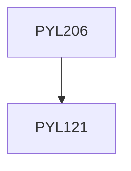

**Credits:** 4 (3-1-0)

**Prerequisites:** [[/Physics/PYL121|PYL121]]

#### Description
Introduction to partial differential equations, vector and tensor analysis, special functions, Integral equations, Introduction to group theory.

### Prerequisite Tree

