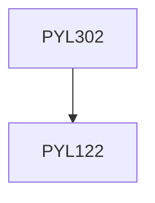

**Credits:** 3 (3-0-0)

**Prerequisites:** [[/Physics/PYL122|PYL122]]

#### Description
Introduction to nuclear structure, Radioactivity and applications, Nuclear detection and acceleration technology, Nuclear reactors engineering, Nuclear techniques for composition analysis, Nuclear radiation in biology.

### Prerequisite Tree

