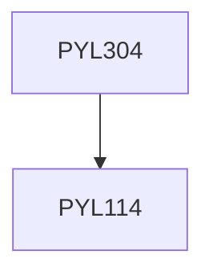

**Credits:** 3 (3-0-0)

**Prerequisites:** [[/Physics/PYL114|PYL114]]

#### Description
Basic properties: zero resistance, perfect diamagnetism, difference from perfect conductors; Critical temperature, Basic Introduction to High Temperature superconductors, Meissner effect, London equations, penetration depth, flux quantization, critical current and critical magnetic field, Thermodynamics of superconducting state, Type I and Type II superconductors, BCS theory, electron pairs; coherence length; energy gap; Isotope effect, Ginzburg-Landau Theory, tunneling of electron in M/I/S, tunneling of electron pairs in S/I/S: DC and AC Josephson effect, Some applications: Electromagnet, SQUID, Oscillators, basics of superconducting electronics and superconducting quantum computing.

### Prerequisite Tree

