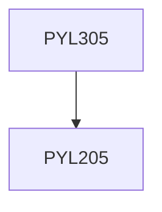

**Credits:** 3 (3-0-0)

**Prerequisites:** [[/Physics/PYL205|PYL205]]

#### Description
Plasma processing of materials, surface cleaning, etching, power/ fusion energy, coherent radiation generation, plasma processing of textiles, nitriding, surface modification, plasma based charged particle accelerators, Hall thrusters.

### Prerequisite Tree

