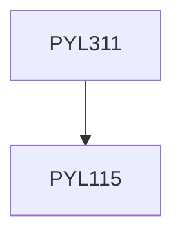

**Credits:** 3 (3-0-0)

**Prerequisites:** [[/Physics/PYL115|PYL115]]

#### Description
Interaction of Radiation with Matter: Einstein coefficients; Line shape function, Line-broadening mechanisms, Condition for amplification by stimulated emission, the meta-stable state and laser action. 3-level and 4-level pumping schemes. Laser Rate Equations: Two-, three- and four-level laser systems, condition for population inversion, gain saturation; Laser amplifiers; Rare earth doped fiber amplifiers. Optical Resonators: Modes of a rectangular cavity, Plane mirror resonators, spherical mirror resonators, ray paths in the resonator, stable and unstable resonators, resonator stability condition; ring resonators; Transverse modes of laser resonators. Gaussian beams in laser resonators. Laser Oscillation: Optical feedback, threshold condition, variation of laser power near threshold, optimum output coupling, Characteristics of the laser output, oscillation frequency, frequency pulling, hole burning and the Lamb dip; Mode selection, single-frequency lasers; Methods of pulsing lasers, Q-switching, mode-locking. Some Laser Systems: Ruby, Nd: YAG, He-Ne, CO2 and excimer lasers, Tunable lasers: Ti Sapphire and dye lasers, Fiber lasers, Semiconductor lasers; Laser safety.

### Prerequisite Tree

