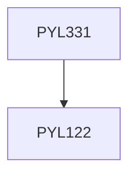

**Credits:** 3 (3-0-0)

**Prerequisites:** [[/Physics/PYL122|PYL122]]

#### Description
Electron in a magnetic field, Landau levels, Quantum Hall effect, Aharonov-Bohm effect. Non-degenerate and Degenerate Time- independent perturbation theory, Examples: Stark effect, Atomic fine-structure, Atomic Hyperfine-structure, Zeeman Effect. Variational method, Examples, WKB Approximation, Examples and comparison. Time-dependent Perturbation theory, Examples, Fermi Golden Rule. Interaction of radiation with matter: Absorption and emission of radiation, Selection rules. Scattering theory: Scattering amplitude, Differential and total cross-sections, Born’s Approximation, Scattering by spherically symmetric potentials, Examples, Rutherford’s formula for Coulomb scattering, Partial wave analysis and Optical theorem, Examples. Relativistic Quantum Mechanics: Klein-Gordon equation, Properties of the free-particle KG equation including negative energy solutions. Dirac equation: The Dirac matrices and Dirac algebra. Spin of the Dirac particle. Dirac particle in an electromagnetic field, including the Pauli equation, magnetic moment and the g-factor, Free particle plane wave solutions, including negative and positive energy solutions.

### Prerequisite Tree

