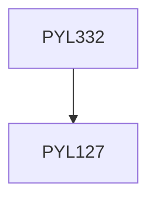

**Credits:** 3 (3-0-0)

**Prerequisites:** [[/Physics/PYL127|PYL127]]

#### Description
Revision of special relativity, Notations, Equivalence principle, Introduction to tensor calculus, Metric, Parallel transport, covariant derivative and Christoffel symbols, Geodesic, Riemann curvature tensor, Ricci tensor, Geodesic deviation equation, Stress-Energy tensor, Einstein equation, Meaning of Einstein equation, Schwarzschild solution, Trajectories in Schwarzschild space-time, Perihelion shift, Binary pulsars, Gravitational deflection of light, Gravitational lensing, Gravitational collapse, Black holes, Hawking Radiation, Gravitational waves, Cosmology: Models of the universe and the cosmological principle, Cosmological metrics, Types of universe, Robertson-Walker universes, Big Bang, Dark energy.

### Prerequisite Tree

