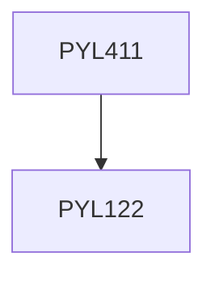

**Credits:** 3 (3-0-0)

**Prerequisites:** [[/Physics/PYL122|PYL122]]

#### Description
Light propagation though anisotropic media, nonlinear effects, nonlinear polarization, Second harmonic generation, sum and difference frequency generation, parametric amplification, parametric fluorescence and oscillation, concept of quasi-phase matching; periodically poled materials and their applications. Third-order effects: self-phase modulations, temporal and spatial solitons, cross-phase modulation, stimulated Raman and Brilloun scattering, four-wave mixing, phase conjugation. Quantization of the electromagnetic field; number states, coherent states and their properties: squeezed states of light and their properties, application of optical parametric processes to generate squeezed states of light, entangled states and their properties; Generation of entangled states; Quantum eraser, Ghost interference effects; Applications in quantum information science. Ultra-intense laser-matter interactions.

### Prerequisite Tree

