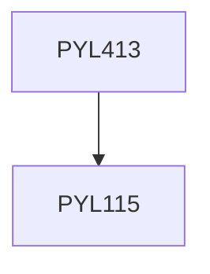

**Credits:** 3 (3-0-0)

**Prerequisites:** [[/Physics/PYL115|PYL115]]

#### Description
Modes in planar optical waveguides: TE and TM modes, Modes in channel waveguides: Effective index and Perturbation method. Directional coupler: coupled mode theory, Integrated Optical devices: Prism Coupling, optical switching and wavelength filtering etc. Step Index and graded index fibers, Attenuation in optical fibers, LP Guided Modes of a step-index fiber, Single-mode fibers, Gaussian approximation and splice loss. Pulse dispersion, Dispersion compensation, Basics of Optical Communication Systems, and recent trends. Fiber fabrication technology and fiber characterization. Periodic interaction in waveguides: Coupled Mode Theory, Fiber Bragg Gratings, Long period Gratings and applications, Optical fiber sensors: basic principles and applications.

### Prerequisite Tree

