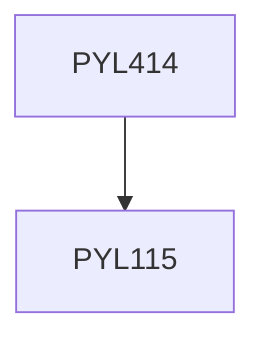

**Credits:** 3 (3-0-0)

**Prerequisites:** [[/Physics/PYL115|PYL115]]

#### Description
Lens systems and basic concepts in their design; Optical components: Mirrors, prisms, gratings and filters; Sources, detectors and their characteristics; Optical systems: Telescopes, microscopes, projection systems, photographic systems, interferometers and spectrometers; Concepts in design of optical systems; Applications in industry, defense, space and medicine; CCD, compact disc, scanner, laser printer, photocopy, laser shows, satellite cameras, IR imagers, LCD, Spatial Light modulators.

### Prerequisite Tree

