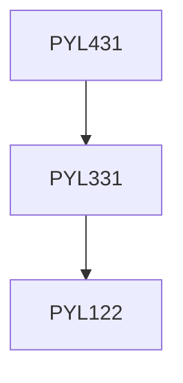

**Credits:** 2 (2-0-0)

**Prerequisites:** [[/Physics/PYL331|PYL331]]

#### Description
Revision of Lorentz transformations, relativistic notations, Lorentz group. The Klein-Gordon equation, negative and positive energy solutions. Charged spin-zero particle, Difficulties with K-G theory. The Dirac equation, Relativistic invariance, Relativistic invariance, spin and energy projection operators. Nonrelativistic limit, Pauli equation, Solutions and their properties. Dirac sea, Anti-particle, Klein paradox, Fodly-Wouthuysen representation. Hydrogen atom, Dirac electron in an electromagnetic field, Charge conjugation.

### Prerequisite Tree

