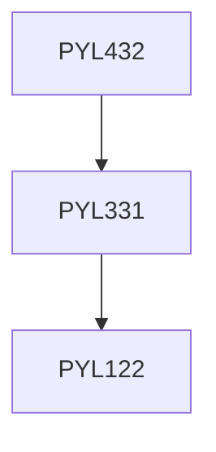

**Credits:** 3 (3-0-0)

**Prerequisites:** [[/Physics/PYL331 | PYL331]]

#### Description 
Lagrangian formulation of classical field theory, Field equations, symmetries, Noether’s theorem and conservation laws. Energy- momentum tensor. Classical field equations: Neutral and charged scalar fields, Electromagnetic field, Dirac field, Momentum representation, Second quantization of the free fields, Interacting fields, interaction picture, Dyson-series,Feynman diagrams and Feynman rules for quantum electrodynamics. Wick’s theorem. Cross-section and S-matrix, Moeller and Bhabha scattering, Compton scattering, photoelectric effect etc. Divergence, Renormalization technique, Mass and charge renormalization.

### Prerequisite Tree

