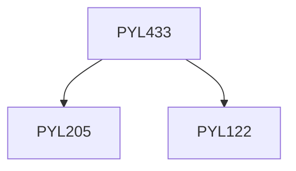

**Credits:** 2 (2-0-0)

**Prerequisites:** [[/Physics/PYL205|PYL205]] & [[/Physics/PYL122|PYL122]]

#### Description
Maxwell’s equations and Gauge invariance,Quantum mechanics of a charged particle as a gauge theory,Vector potential as phase, Aharonov-Bohm Effect,Superconductivity and Magnetic flux quantization in superconductors, Introduction to continuous symmetry groups, U(1) and SU(2) symmetry groups,Classical field theories, Local gauge invariance and the gauge fields,Yang-Mills gauge theories, Spontaneous symmetry breaking, Goldstone bosons, Higgs machanism, Weinberg-Salam Model.

### Prerequisite Tree

