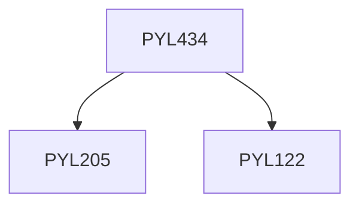

**Credits:** 2 (2-0-0)

**Prerequisites:** [[/Physics/PYL205|PYL205]] & [[/Physics/PYL122|PYL122]]

#### Description
Electrostatic and electromagnetic accelerators: Van de Graff, Tandem acceleration, Linear accelerators, Synchrocyclotron, Storage ring, Free electron laser, High energy colliders.

### Prerequisite Tree

