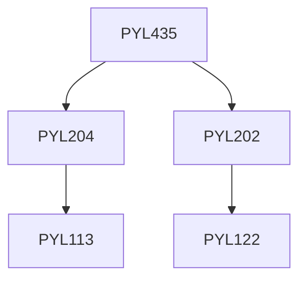

**Credits:** 3 (2-1-0)

**Prerequisites:** [[/Physics/PYL204 | PYL204]], [[/Physics/PYL202 | PYL202]]

#### Description 
Introduction to computer simulation, Model systems and interaction potential, Relation of Physics and computer simulations, Basic Monte Carlo simulation in equilibrium and non-equilibrium systems, Introduction to Molecular dynamics, Molecular Dynamics in equilibrium and non-equilibrium systems. Analysis of the results.

### Prerequisite Tree

