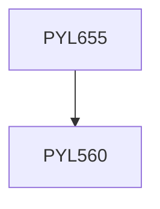

**Credits:** 3 (3-0-0)

**Prerequisites:** [[/Physics/PYL560|PYL560]]

#### Description
Introduction. Physics of interaction between Radiation and Atomic systems including: Stimulated emission, emission line shapes and dispersion effects. Gain saturation in laser media and theory of Fabry- Perot laser. Techniques for the control of laser output employing Q- switching, mode-locking and mode-dumping. Optical cavity design and laser stability criteria. Description of common types of conventional lasers. Physics of semiconducting optical materials, degenerate semiconductors and their Homo-junctions and Hetero-junctions. Light emitting diodes (LED’s) junction lasers. Characteristics of diode laser arrays and applications.

### Prerequisite Tree

