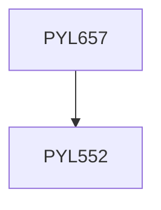

**Credits:** 3 (3-0-0)

**Prerequisites:** [[/Physics/PYL552|PYL552]]

#### Description
Introduction to plasma, Debye shielding, Single particle motion in E and B fields, Mirror confinement, Plasma oscillations, Waves in unmagnetized plasmas, Solitons, Two stream instability, Rayleigh Taylor instability, Vlasov equation and Landau damping, Waves in magnetized plasmas (fluid theory), Plasma production & characterization, Plasma processing of materials, Laser driven fusion, Cerenkov free electron laser, Applications to astrophysics and astronomy.

### Prerequisite Tree

