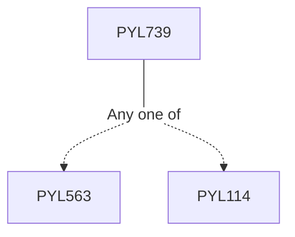

**Credits:** 3 (3-0-0)

**Prerequisites:** [[/Physics/PYL563|PYL563]]/[[/Physics/PYL114|PYL114]] or equivalent

#### Description
Numerical solution of equations of motion, NVT molecular dynamics (MD), Application of MD for continuous and discontinuous potentials, Probability, Markov chains and master equations, Simple sampling by Monte Carlo (MC) methods, MC simulations for non-equilibrium and irreversible systems, Schrodinger Equation, The Born-Oppenheimer approximation, Wave-funtion based methods, Hartree theory, Hartree- Fock Theory, Density Functional Theory (DFT), Exchange Correlation Functional.

### Prerequisite Tree

