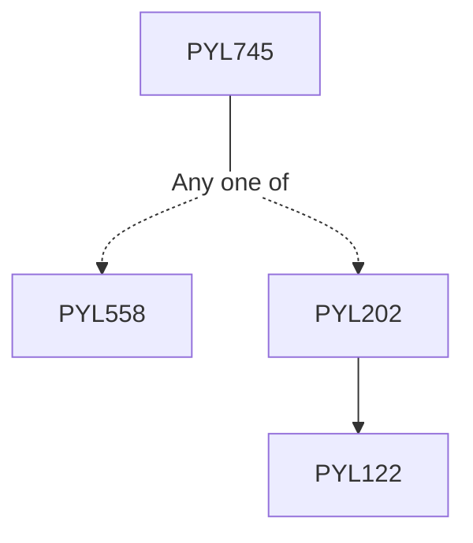

**Credits:** 3 (3-0-0)

**Prerequisites:** [[/Physics/PYL558|PYL558]]/[[/Physics/PYL202|PYL202]]/equivalent

#### Description
Review of basic thermodynamics, Thermodynamic potentials, Equation of state. Theory of ensembles, Density matrix. Thermodynamics of phase transitions, Concept of thermodynamic stability, Metastability and instability, Vander Waal equation of state, Phase coexistence: and Gibbs phase rule. Lattice models to describe phase transition e.g. Ising model, Heisenberg model Landau theory of second order phase transitions, Scaling hypothesis, Critical exponents and universality classes, Spatial correlation, Correlation length, Importance of fluctuations near critical point. Mean Field theory, Transfer matrix method. Concept of renormalization group. Ising model, Renormalization in one dimension. Related numerical methods, Monte-Carlo simulations of spin systems.

### Prerequisite Tree

