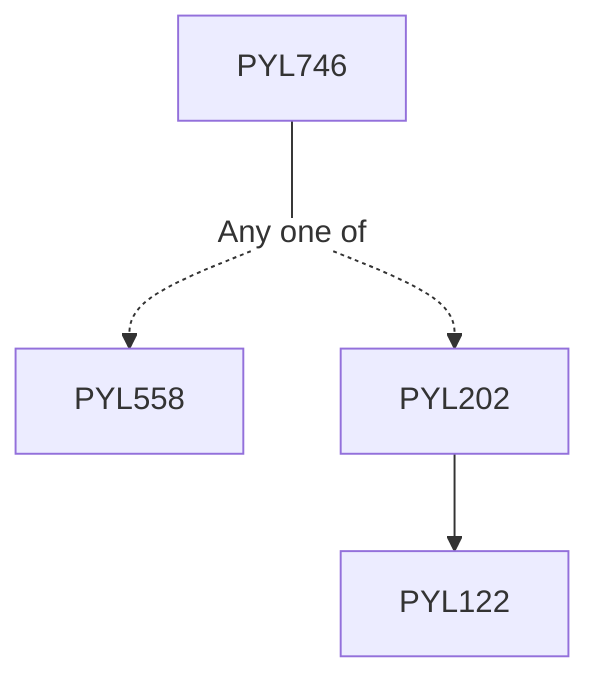

**Credits:** 3 (3-0-0)

**Prerequisites:** [[/Physics/PYL558 | PYL558]]/[[/Physics/PYL202 | PYL202]]/equivalent

#### Description 
Review of equilibrium systems. Systems out of equilibrium, Kinetic theory of gases, Boltzman equation and its application to transport problems, Master equation and irreversibility. Time correlation functions, linear response theory, Kubo formula, Onsager relations. Random walks, Brownian motion and diffusion, Langevin equation, Fluctuation dissipation theorem, Einstein relation, Fokker-Planck equation. Some selected topics in rachets, Driven diffusive systems. Fluctuation theorems, Jarzynski Equality. Percolation, Polymers, Soft condensed matter systems. Biological systems, Applications to Molecular motors, Stochasticity in gene expression. Stochastic growth models. Monte-Carlo simulations of Random walks and their applications to polymers, Percolation, Diffusion limited aggregation and other growth models.

### Prerequisite Tree

