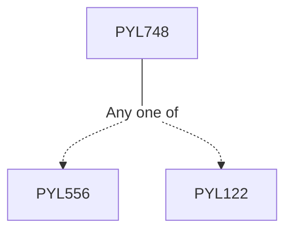

**Credits:** 3 (3-0-0)

**Prerequisites:** [[/Physics/PYL556|PYL556]]/[[/Physics/PYL122|PYL122]]

#### Description
HBT effect, Quantization of the EM field, Quantum states of light, correlation functions, Detection of quantum light and techniques, coincidence-counting, Phase-sensitive detection, Quantum treatment of linear optics, Quantum light by non-linear optical processes, SPDC, Signatures of quantum behaviour, Landmark experiments in quantum optics, Applications: Laser cooling and BEC, Ion trapping, CPT, EIT, Slow light, Introduction to quantum communication: Quantum teleportation, Entanglement swapping, Quantum repeaters, Quantum cryptography.

### Prerequisite Tree

