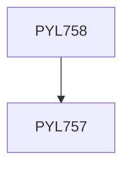

**Credits:** 3 (3-0-0)

**Prerequisites:** [[/Physics/PYL757|PYL757]]

#### Description
Quantization of the EM field, Quantum states of light, Correlation functions, Photodetection techniques, Generation of quantum light, Detection of quantum light, coincidence-counting, Phase-sensitive detection, Quantum treatment of linear optics, Quantum light by non- linear optical processes, Signatures of quantum behaviour, Squeezed states and applications, Landmark experiments in quantum optics, Light-matter interaction, Quantum memories, Experimental quantum communications : Quantum teleportation, Entanglement swapping, Quantum repeaters.

### Prerequisite Tree

