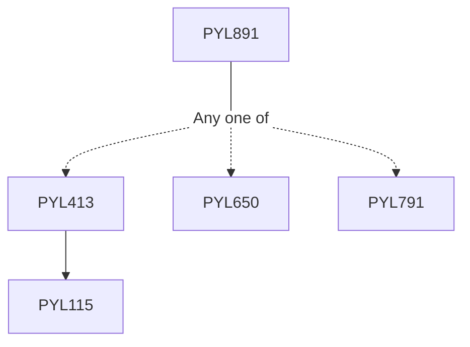

**Credits:** 3 (3-0-0)

**Prerequisites:** [[/Physics/PYL413|PYL413]] or [[/Physics/PYL650|PYL650]] or [[/Physics/PYL791|PYL791]]

#### Description
Review of optical fiber properties: step and graded index fibers, multimode, single mode, birefringent, photonic crystal and holey fiber: Directional couplers: Analysis, fabrication and characterization: Fused and polished fiber couplers application in power dividers, wavelength division multiplexing, interleavers and loop mirrors: Fiber half-block devices and application in polarizers, and wavelength filters. Fiber grating: Short and Long period gratings, Analysis, fabrication and characterization: application in add-drop multiplexing, gain flattening, dispersion compensation and wavelength locking and sensing. Polarization effects in Optical fibers, Fiber polarization components: Fiber optic wave-plates, polarization controllers and associated micro- optic components like isolators and circulators; Optical fiber sensors: Intensity, phase, polarization and wavelength-shift based sensors, applications in various disciplines.

### Prerequisite Tree

