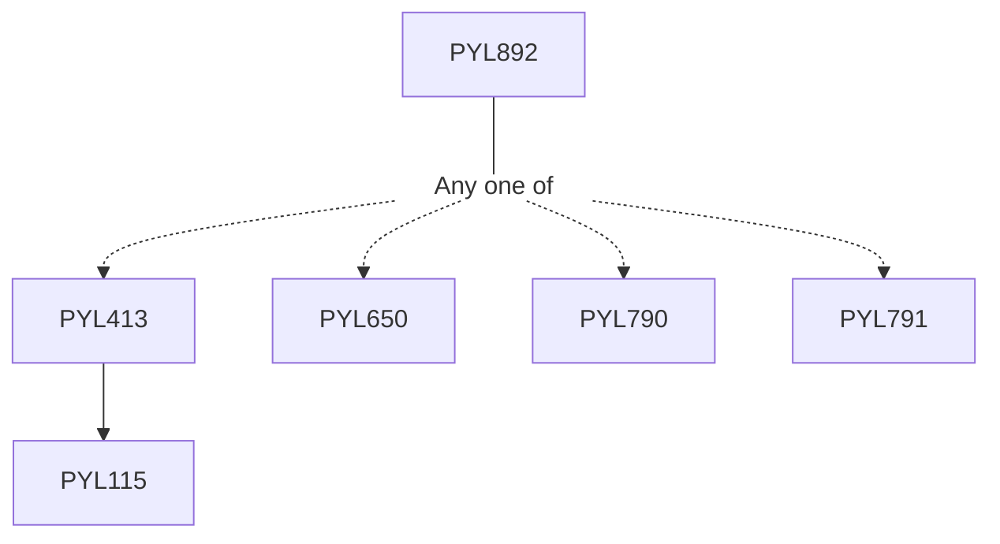

**Credits:** 3 (3-0-0)

**Prerequisites:** [[/Physics/PYL413 | PYL413]] or [[/Physics/PYL650 | PYL650]] or [[/Physics/PYL790 | PYL790]] or [[/Physics/PYL791 | PYL791]]

#### Description 
Review of propagation characteristics of single and multimode optical Fibers and Integrated optical Waveguides. Surface plasmon modes supported by a single metal/dielectric interface and metal/dielectric waveguides. Fiber Optic Sensors: Intensity, phase, polarization and wavelength modulation schemes. Intensity based sensors: using microbends and tapers in multimode fibers, Mach-Zehnder interferometer sensors, Fiber Optic gyroscope, Fiber optic current sensor, Photonic crystal based sensors. Sensors based on Bragg and Long period gratings in Fiber and integrated optical waveguides, Sensors based on modal interference: Applications in temperature, strain and refractive index sensing. Distributed Sensors based on Raman and Brillouin Scattering. Surface Plasmon Resonance (SPR) bio-sensors based on Krechman and Otto configurations, coupling with optical fiber modes, Grating coupled, Localised SPR, Plasmonic nanoparticles, interferometry. Signal processing, Noise factors in sensors and sensor networking.

### Prerequisite Tree

