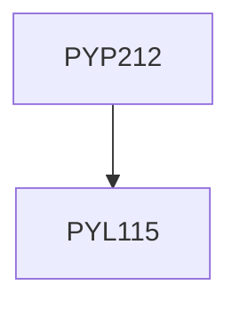

**Credits:** 3 (0-0-6)

**Prerequisites:** [[/Physics/PYL115|PYL115]]

#### Description
Characterisation of optoelectronic/semiconductor devices, Holography, Determination of characteristic parameters of different types of optical fibers, Applications of Fiber Optics: experiments related to communication and sensors.

### Prerequisite Tree

