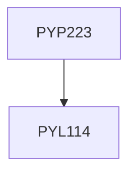

**Credits:** 3 (0-0-6)

**Prerequisites:** [[/Physics/PYL114|PYL114]]

#### Description
Synthesis of thin films, multilayers, nanoparticles by physical and chemical vapor deposition techniques, phase diagrams, study of surface, design of thin film resistor and magnetic field sensor.

### Prerequisite Tree

