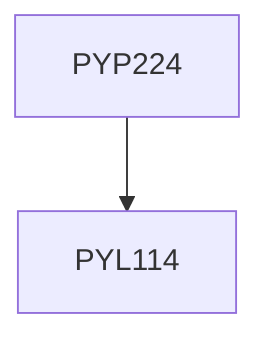

**Credits:** 3 (0-0-6)

**Prerequisites:** [[/Physics/PYL114|PYL114]]

#### Description
Resistivity of metals and semiconductors, band gap, charge carrier density and mobilities of semiconductor, basics of junction diode and its characteristics in solar cell configuration, study of crystal structure, dielectric constant, specific heat and superconductivity.

### Prerequisite Tree

