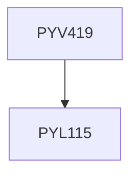

**Credits:** 1 (1-0-0)

**Prerequisites:** [[/Physics/PYL115|PYL115]]

#### Description
Topics from the emerging areas of Photonics will form the basics, and the faculty offering the course will provide the detailed course contents.

### Prerequisite Tree

