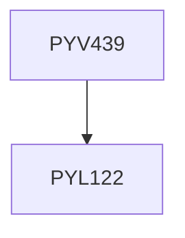

**Credits:** 1 (1-0-0)

**Prerequisites:** [[/Physics/PYL122|PYL122]]

#### Description
Topics from the emerging areas of Theoretical Physics will form the basics, and the faculty offering the course will provide the detailed course contents.

### Prerequisite Tree

