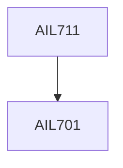

**Credits:** 3 (3-0-0)

**Prerequisites:** [[/School of Artificial Intelligence/AIL701|AIL701]]

**Overlaps with:** MTL704, CLL782

#### Description
General properties of algorithm, global convergence, rate of convergence, unconstrained optimization techniques - one dimensional methods: Fibonacci method, Golden section method, interpolation. Multi-dimensional methods: pattern search method, Nelder and Meed method, gradient based methods: steepest descent method and its variants recall, conjugate direction and gradient method, quasi-Newton method. Constrained optimization techniques - penalty method, barrier method, projection gradient method, sequential quadratic programming approach. Semidefinite and cone programming

### Prerequisite Tree

