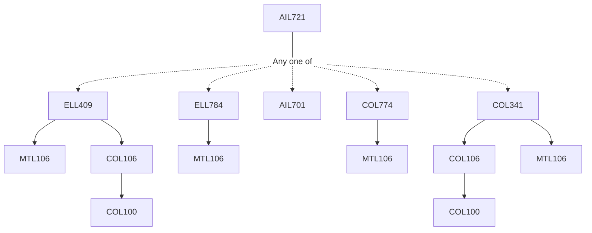

**Credits:** 4 (3-0-2)

**Prerequisites:** Any one of [[/Electrical Engineering/ELL409|ELL409]] / [[/Electrical Engineering/ELL784|ELL784]] / [[/School of Artificial Intelligence/AIL701|AIL701]] / [[/Computer Science and Engineering/COL774|COL774]]/ [[/Computer Science and Engineering/COL341|COL341]]

**Overlaps with:** COL775 approx. 80%. APL745 approx. 40%. [COL341, COL774, ELL409, ELL784] < 15%

#### Description
Introduction to representation learning, limitations of classical ML methods Introduction to DNN Universal approximation theorem, mathematical foundations and introduction to deep architectures, Activation functions, Learning DNN, gradient descent, Computational Graphs and Back Propagation, Regularization - Bias-Variance trade- off, Norm-penalty Early stopping Regularization: Bagging, Boosting, Ada-boost, Dropout, Batch Norm and other regularization techniques Optimization algorithms – SGD, Momentum, RMSProp, Adaptive gradient algorithms (ADAgrad, ADAM etc.) Convolutional Neural Networks (CNNs), Architectures few applications such as Object Localization Detection and Segmentation, Action Classification, sequential Models, BPTI, Problems with Recurrent neural Networks (RNNs), Long Short Term Memory (LSTM) / Gated Recurrent Units (GRUs), Bidirectional LSTMs (BLTSMs), Applications of RNNs to NLP, Language Model Unsupervised representational learning Auto Encoders and its variants, Variational inference and Deep learning: Variational Auto Encoders (VAE) and its variants, Generative Adversarial Networks Graph Convolutional networks (GCNs), Graph Attention Networks (GATs), Deep Reinforcement Learning, Advanced Topics: Fairness and Explainability in DL Adversarial Learning Neuro- Symbolic Reasoning, Neural Architecture Search.

### Prerequisite Tree

