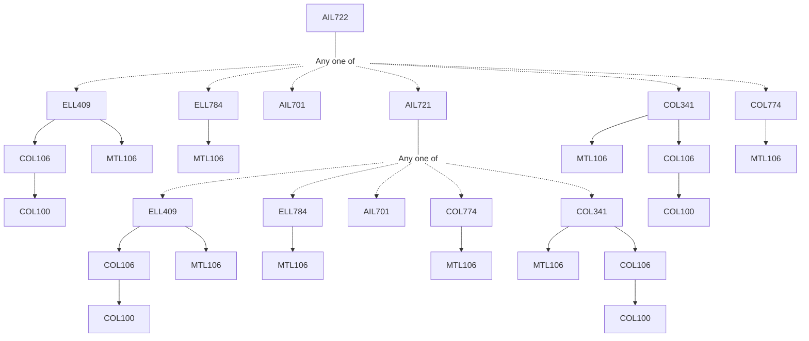

**Credits:** 3 (3-0-0)

**Prerequisites:** Any one of [[/Electrical Engineering/ELL409|ELL409]] / [[/Electrical Engineering/ELL784|ELL784]] / [[/School of Artificial Intelligence/AIL701|AIL701]] / [[/School of Artificial Intelligence/AIL721|AIL721]]/ [[/Computer Science and Engineering/COL341|COL341]] / [[/Computer Science and Engineering/COL774|COL774]]

**Overlaps with:** ELL729 approx. 50 %. [COL333, COL341, COL770, COL774, ELL409, ELL784, ELL802, ELL888) < 10%

#### Description
Introduction and Basics of RL, Markov Decision Processes (MDPs), Dynamic Programming, Monte Carlo Methods (Prediction), Temporal difference Methods (Prediction), Monte Carlo, TD Method (Control), Monte Carlo, TD Method (Control - cont.), N-step TD, EligibiJity Traces, Model based RL, (Action-)Value Function Approximation, Value Function Approximation, Policy Gradient, Policy Gradient, Misc. Topics.

### Prerequisite Tree

