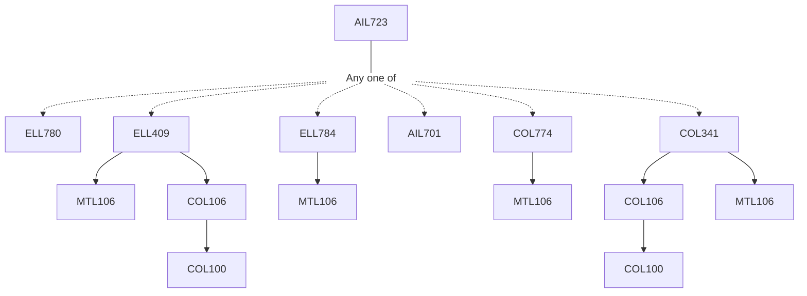

**Credits:** 4 (3-0-2)

**Prerequisites:** [[/Electrical Engineering/ELL780 | ELL780]] / [[/Electrical Engineering/ELL409 | ELL409]] / [[/Electrical Engineering/ELL784 | ELL784]] / [[/School of Artificial Intelligence/AIL701 | AIL701]] / [[/Computer Science and Engineering/COL774 | COL774]]/ [[/Computer Science and Engineering/COL341 | COL341]]

#### Description 
Introduction and Motivations for Machine Learning with Graphs, Graph and its Matrices, Graph Theory, Laplacian Matrix and Smoothness, Graph Learning from Data, Graph Embedding, Label Propagation, Manifold Regularization, semi-, un-, and supervised Learning with Graphs, Graph Data Mining, Deep Learning with Graphs.

### Prerequisite Tree

