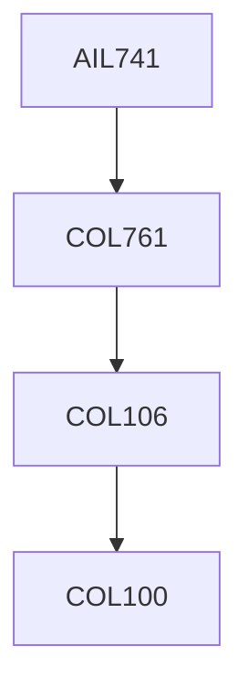

**Credits:** 4 (3-0-2)

**Prerequisites:** Pre-requisite(s): [[/Computer Science and Engineering/COL761 | COL761]] or with instructor's permission

#### Description 
Graph Structural properties; Basics of Spectral graph theory and random walks on graphs; Random graph models; Graph Generative Models; Queries and Index structures for graphs; Graph clustering and community detection; Social Network Analysis; Graph Mining; Graph Neural Networks.

### Prerequisite Tree

