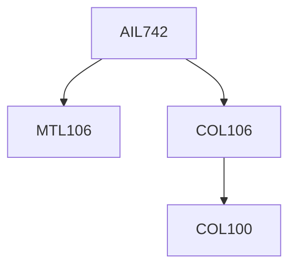

**Credits:** 4 (3-0-2)

**Prerequisites:** [[/Computer Science and Engineering/COL106|COL106]], [[/Mathematics/MTL106|MTL106]] or with instructor’s permission.

#### Description
Sampling and sketching (reservoir sampling, counting samples, graph sampling, count-min sketches, Flajolet sketches, graph sketches, heavy hitters, Johnson-Lindenstrauss lemma and dimensionality reduction techniques); data integration (schema alignment, information extraction, entity linkage, data fusion); data profiling and cleaning (rule-based data cleaning, outlier detection, data transformations, probabilistic data cleaning); issues in building large-scale machine learning models (noise and bias in data, model data management).

### Prerequisite Tree

