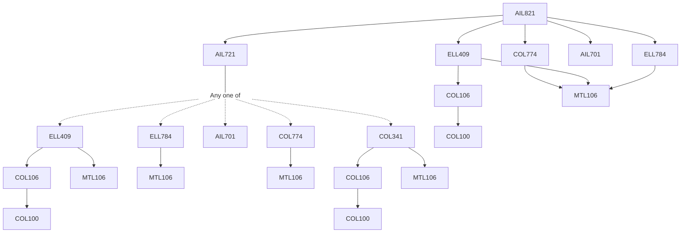

**Credits:** 3 (3-0-0)

**Prerequisites:** [[/Electrical Engineering/ELL409 | ELL409]], [[/Electrical Engineering/ELL784 | ELL784]], [[/School of Artificial Intelligence/AIL701 | AIL701]], [[/Computer Science and Engineering/COL774 | COL774]], [[/School of Artificial Intelligence/AIL721 | AIL721]]

#### Description 
Recent advances in Deep learning, Reinforcement learning, and its applications in the areas of Computer Vision, Speech processing, Natural Language Processing etc.

### Prerequisite Tree

