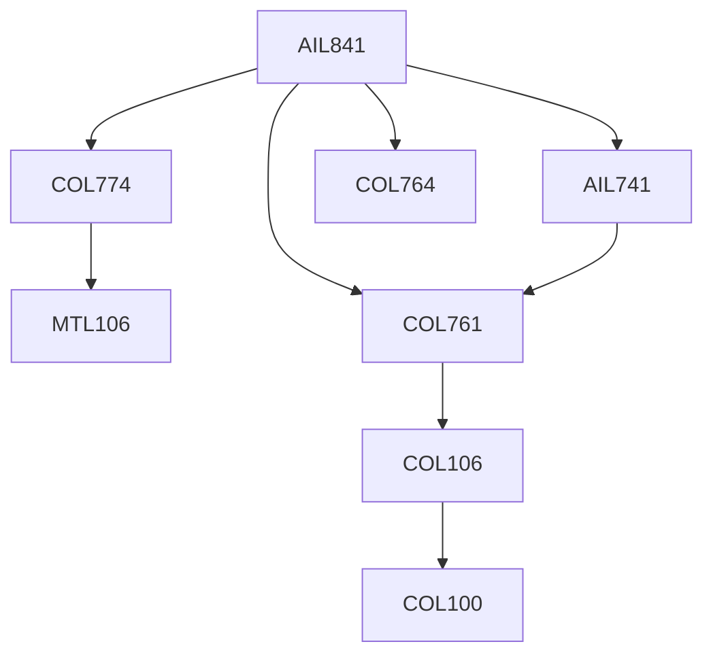

**Credits:** 3 (3-0-0)

**Prerequisites:** [[/Computer Science and Engineering/COL761 | COL761]], [[/Computer Science and Engineering/COL774 | COL774]], [[/Computer Science and Engineering/COL764 | COL764]], [[/School of Artificial Intelligence/AIL741 | AIL741]]

#### Description 
Recent advances in big-data management, applications of machine learning to understand structured and unstructured data in large enterprises, human-centric analysis of large-data, spatio-temporal analytics, data cleaning and data integration using machine learning etc.

### Prerequisite Tree

