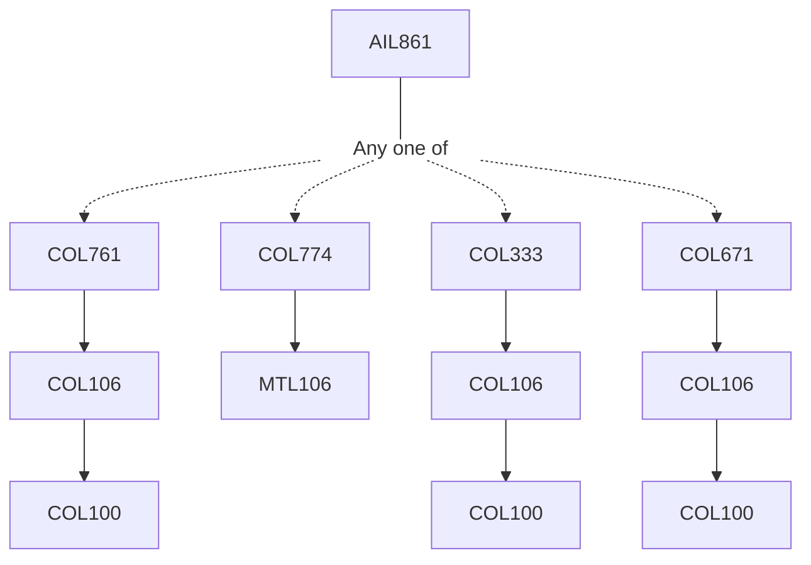

**Credits:** 3 (3-0-0)

**Prerequisites:** Pre-requisite(s): One of [[/Computer Science and Engineering/COL761 | COL761]], [[/Computer Science and Engineering/COL774 | COL774]], [[/Computer Science and Engineering/COL333 | COL333]] or [[/Computer Science and Engineering/COL671 | COL671]]

#### Description 
The course will focus on one or two of the specialized applications of AI such as computational biology, genetics, healthcare, wellness, transportation systems, software development, hardware design, recommendation systems, music, etc. The course will discuss the various AI techniques developed for problems in these domains.

### Prerequisite Tree

