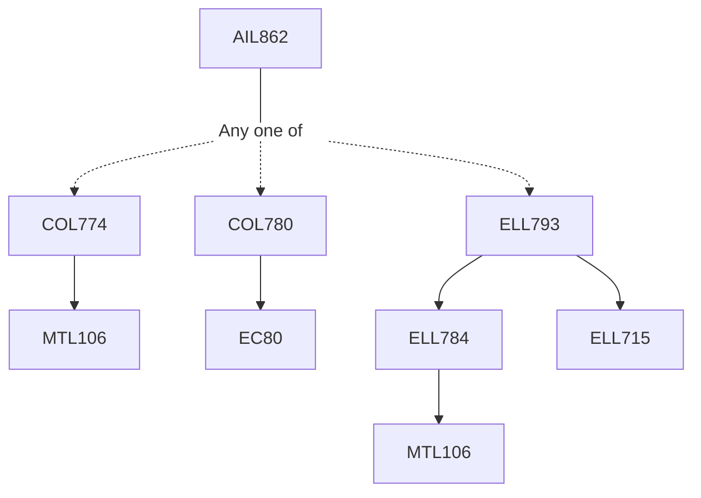

**Credits:** 3 (3-0-0)

**Prerequisites:** One of [[/Computer Science and Engineering/COL774 | COL774]], or [[/Computer Science and Engineering/COL780 | COL780]], or [[/Electrical Engineering/ELL793 | ELL793]]

#### Description 
The course will focus on few specialized applications of computer vision such as mobility, transportation systems, healthcare, wellness, virtual and augmented reality, computational biology, genetics, etc. The course will discuss various computer vision techniques developed for problems in these domains.

### Prerequisite Tree

