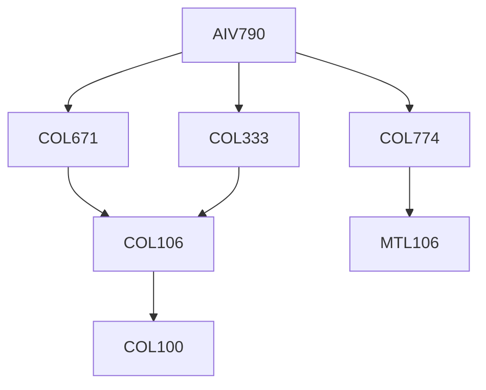

**Credits:** 1 (1-0-0)

**Prerequisites:** [[/Computer Science and Engineering/COL333 | COL333]], [[/Computer Science and Engineering/COL671 | COL671]], [[/Computer Science and Engineering/COL774 | COL774]], or with instructor’s permission.

#### Description 
Introduction to ethical issues in AI: bias, fairness, transparency, reliability, accountability, job loss, privacy, human-aware AI. AI models to debias training data. Explainability in ML. Adversarial robustness. Federated learning.

### Prerequisite Tree

