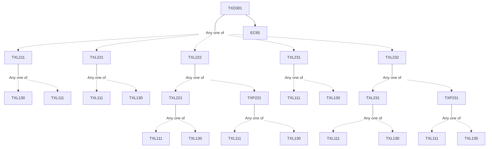

**Credits:** 3 (0-0-6)

**Prerequisites:** [[/Textile and Fibre Engineering/TXL211 | TXL211]]/[[/Textile and Fibre Engineering/TXL221 | TXL221]]/[[/Textile and Fibre Engineering/TXL222 | TXL222]]/[[/Textile and Fibre Engineering/TXL231 | TXL231]]/[[/Textile and Fibre Engineering/TXL232 | TXL232]] and EC65

#### Description 
No description available

### Prerequisite Tree

