**Credits:** 4 (0-0-8)

**Prerequisites:** [[/Textile and Fibre Engineering/TXL361 | TXL361]]/[[/Textile and Fibre Engineering/TXP361 | TXP361]]/[[/Textile and Fibre Engineering/TXL371 | TXL371]]/[[/Textile and Fibre Engineering/TXL372 | TXL372]] and EC 100

#### Description 
Formation of project team (up to two students and up to two faculty guides); formulation of work plan completing targeted work for the semester and presentation of complete work of progress for award of grade.

### Prerequisite Tree

```mermaid
flowchart TD
TXD401-374[TXD401]
TXD401-374 --> EC100-374[EC100]
TXD401-374 --- Or375[Any one of]:::empty
TXL222-376 --- Or377[Any one of]:::empty
Or377 -.-> TXL221-378[TXL221]
TXL221-378 --- Or379[Any one of]:::empty
Or379 -.-> TXL111-380[TXL111]
Or379 -.-> TXL130-381[TXL130]
Or377 -.-> TXP221-382[TXP221]
TXP221-382 --- Or383[Any one of]:::empty
Or383 -.-> TXL111-384[TXL111]
Or383 -.-> TXL130-385[TXL130]
TXL361-376 --> TXL222-376[TXL222]
TXL232-376 --- Or386[Any one of]:::empty
Or386 -.-> TXL231-387[TXL231]
TXL231-387 --- Or388[Any one of]:::empty
Or388 -.-> TXL111-389[TXL111]
Or388 -.-> TXL130-390[TXL130]
Or386 -.-> TXP231-391[TXP231]
TXP231-391 --- Or392[Any one of]:::empty
Or392 -.-> TXL111-393[TXL111]
Or392 -.-> TXL130-394[TXL130]
Or375 -.-> TXL361-376[TXL361]
TXL361-376 --> TXL232-376[TXL232]
Or375 -.-> TXP361-395[TXP361]
TXP361-395 --- Or411[Any one of]:::empty
Or411 -.-> TXL232-412[TXL232]
TXL232-412 --- Or413[Any one of]:::empty
Or413 -.-> TXL231-414[TXL231]
TXL231-414 --- Or415[Any one of]:::empty
Or415 -.-> TXL111-416[TXL111]
Or415 -.-> TXL130-417[TXL130]
Or413 -.-> TXP231-418[TXP231]
TXP231-418 --- Or419[Any one of]:::empty
Or419 -.-> TXL111-420[TXL111]
Or419 -.-> TXL130-421[TXL130]
Or411 -.-> TXL231-422[TXL231]
TXL231-422 --- Or423[Any one of]:::empty
Or423 -.-> TXL111-424[TXL111]
Or423 -.-> TXL130-425[TXL130]
TXP361-395 --- Or396[Any one of]:::empty
TXL222-397 --- Or398[Any one of]:::empty
Or398 -.-> TXL221-399[TXL221]
TXL221-399 --- Or400[Any one of]:::empty
Or400 -.-> TXL111-401[TXL111]
Or400 -.-> TXL130-402[TXL130]
TXP221-403 --- Or404[Any one of]:::empty
Or404 -.-> TXL111-405[TXL111]
Or404 -.-> TXL130-406[TXL130]
Or398 -.-> TXP221-403[TXP221]
Or396 -.-> TXL222-397[TXL222]
TXL221-407 --- Or408[Any one of]:::empty
Or408 -.-> TXL111-409[TXL111]
Or408 -.-> TXL130-410[TXL130]
Or396 -.-> TXL221-407[TXL221]
TXL371-426 --> TXL222-426[TXL222]
TXL371-426 --> TXL232-426[TXL232]
Or375 -.-> TXL371-426[TXL371]
TXL222-426 --- Or427[Any one of]:::empty
Or427 -.-> TXL221-428[TXL221]
TXL221-428 --- Or429[Any one of]:::empty
Or429 -.-> TXL111-430[TXL111]
Or429 -.-> TXL130-431[TXL130]
TXP221-432 --- Or433[Any one of]:::empty
Or433 -.-> TXL111-434[TXL111]
Or433 -.-> TXL130-435[TXL130]
Or427 -.-> TXP221-432[TXP221]
TXL232-426 --- Or436[Any one of]:::empty
Or436 -.-> TXL231-437[TXL231]
TXL231-437 --- Or438[Any one of]:::empty
Or438 -.-> TXL111-439[TXL111]
Or438 -.-> TXL130-440[TXL130]
Or436 -.-> TXP231-441[TXP231]
TXP231-441 --- Or442[Any one of]:::empty
Or442 -.-> TXL111-443[TXL111]
Or442 -.-> TXL130-444[TXL130]
TXL232-445 --- Or455[Any one of]:::empty
TXL231-456 --- Or457[Any one of]:::empty
Or457 -.-> TXL111-458[TXL111]
Or457 -.-> TXL130-459[TXL130]
Or455 -.-> TXL231-456[TXL231]
TXP231-460 --- Or461[Any one of]:::empty
Or461 -.-> TXL111-462[TXL111]
Or461 -.-> TXL130-463[TXL130]
Or455 -.-> TXP231-460[TXP231]
Or375 -.-> TXL372-445[TXL372]
TXL372-445 --> TXL232-445[TXL232]
TXL222-445 --- Or446[Any one of]:::empty
Or446 -.-> TXL221-447[TXL221]
TXL221-447 --- Or448[Any one of]:::empty
Or448 -.-> TXL111-449[TXL111]
Or448 -.-> TXL130-450[TXL130]
TXP221-451 --- Or452[Any one of]:::empty
Or452 -.-> TXL111-453[TXL111]
Or452 -.-> TXL130-454[TXL130]
Or446 -.-> TXP221-451[TXP221]
TXL372-445 --> TXL222-445[TXL222]

classDef empty height:17px, fill:transparent, stroke:transparent;
classDef trueEmpty height:0px, width:0px;
```

