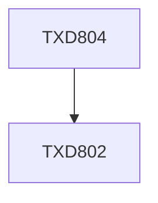

**Credits:** 12 (0-0-24)

**Prerequisites:** [[/Textile and Fibre Engineering/TXD802|TXD802]]

#### Description
To learn about preparation of research plan and systematically carry out research project.

### Prerequisite Tree

