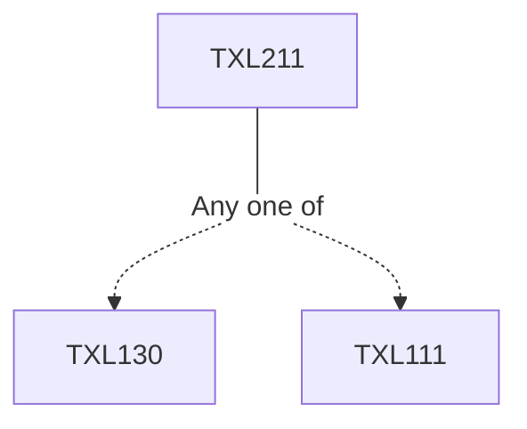

**Credits:** 3 (3-0-0)

**Prerequisites:** [[/Textile and Fibre Engineering/TXL130|TXL130]]/[[/Textile and Fibre Engineering/TXL111|TXL111]]

#### Description
Molecular architecture. Configuration. Conformation. Amorphous and crystalline phases. Glass transition. Crystallization. Melting. Structures in natural and synthetic fibres. Characterization techniques. Fibre properties. Moisture absorption properties. Mechanical properties. Fibre friction. Optical properties. Thermal properties.

### Prerequisite Tree

