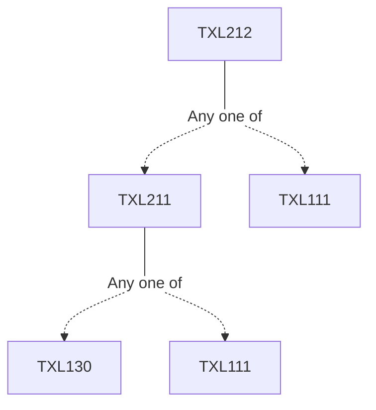

**Credits:** 3 (3-0-0)

**Prerequisites:** [[/Textile and Fibre Engineering/TXL211 | TXL211]]/[[/Textile and Fibre Engineering/TXL111 | TXL111]]

#### Description 
Polymer rheology in shear as well as extension. Polymer entanglements. Flow instabilities in polymer fluids. Principles of solidification. Heat and mass transfer. Melt spinning. Force and momentum balance in spinline. Stress induced crystallization. Experimental observations from melt spinning of polyamides and polyesters. Solution spinning. Dry and wet spinning. Transport phenomena. Kinetic and thermodynamic effects in solution spinning. Solution spinning of viscose and acrylic fibres. Dry jet wet spinning. Post spinning processes. Drawing and heat setting. Stress-strain-structure relationship. Effect of post spinning operations on fibre structure and properties. Spin finish applications. Introduction to electrospinning.

### Prerequisite Tree

