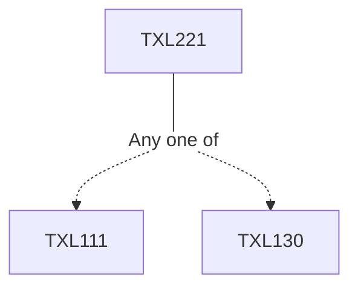

**Credits:** 3 (3-0-0)

**Prerequisites:** [[/Textile and Fibre Engineering/TXL111|TXL111]] or [[/Textile and Fibre Engineering/TXL130|TXL130]]

#### Description
Impurities in natural fibres. Separation of trash and lint. Pre-baling operations for staple fibres. Purpose of opening, cleaning, mixing and blending of fibres. Blow room machinery and operating elements. Principles of fibre opening and cleaning in blow room. Transportation of fibre mass. Influence of process parameters on opening and cleaning. Analysis of opening and cleaning processes. Principles and methods of fibre mixing and blending. Principles of carding. Machine elements and operations in card. Sliver formation, Sliver packaging, fibre configurations in sliver. Objectives, principles and methods of roller drafting. Purpose and principle of condensation of fibres. Causes of mass variation of sliver and control. Automation and recent developments in blowroom, card and draw frames. Fibre opening, carding and drawing for wool, jute and other fibres. Modification in process parameters for processing blended fibres in blowroom, card and drawframe.

### Prerequisite Tree

