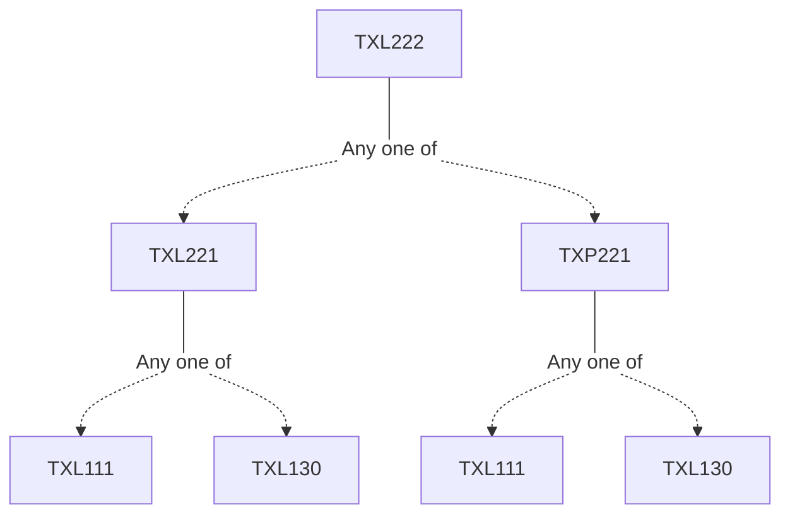

**Credits:** 3 (3-0-0)

**Prerequisites:** [[/Textile and Fibre Engineering/TXL221|TXL221]]/[[/Textile and Fibre Engineering/TXP221|TXP221]]

#### Description
Fibre fractionation and combing. Preparation of fibre assembly for combing. Principle of operations of a rectilinear comber. Combing machine elements. Timing diagram theory of fibre fractionation. Roving formation: Elements of roving frame, drafting, twisting and winding in roving frame, principle and mechanism of builder motion in roving frame. Yarn formation: Elements of ring frame, drafting, twisting and winding in ring frame, design aspects of spindles, rings and travellers, builder motion in ring frame. Spinning geometry. Twist and yarn strength. Yarn doubling : Purpose of doubling and plying of yarns, ring doubling, two-for-one and three for one twisting. New spinning methods: Principles of yarn formation in rotors, friction, airjet, and vortex spinning. Yarn structure and property comparison.

### Prerequisite Tree

