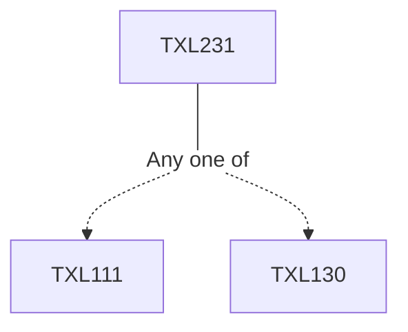

**Credits:** 3 (3-0-0)

**Prerequisites:** [[/Textile and Fibre Engineering/TXL111|TXL111]] or [[/Textile and Fibre Engineering/TXL130|TXL130]]

#### Description
Introduction to various fabric forming principles: weaving, knitting, nonwoven and braiding. Stages of woven fabric manufacturing: winding, warping, sizing, drawing and tying in and weaving. Winding: principles, precision and random winding, digicone winding, yarn tensioning and clearing. Warping: direct and sectional warping. Sizing: size materials, sizing machines, process and quality control, modern trends. Drawing and tying in. Basic fabric designs: plain, matt, rib, twill and satin, drafting and lifting plans. Primary motions of shuttle looms: cam shedding, cam designs, dobby and jacquard systems, picking systems, loom timing, beat up, sley eccentricity. Secondary and auxiliary motions: take up, let off, warp and weft stop and warp protecting motions.

### Prerequisite Tree

