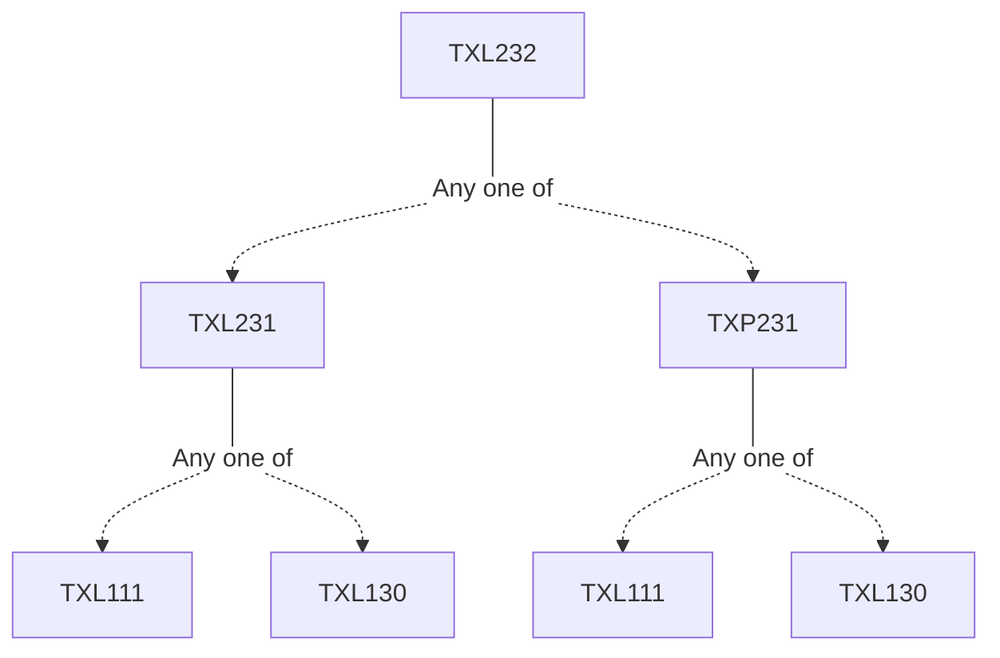

**Credits:** 3 (3-0-0)

**Prerequisites:** [[/Textile and Fibre Engineering/TXL231 | TXL231]]/[[/Textile and Fibre Engineering/TXP231 | TXP231]]

#### Description 
Shuttleless looms: Principles of weft insertion in projectile, rapier, air-jet and water-jet looms, comparison of various weft insertion systems, principles of two phase, multiphase, circular and narrow fabric weaving. Leno weaving, Triaxial weaving, different types of selvages, common fabric defects, Knitting: Basic weft and warp knitted constructions, cams and needles, different weft and warp knitted structures and their properties, weft and warp knitting machines. Nonwovens: Definitions and classifications, production technology, selection criteria and important properties of fibres used, different types of web information and bonding techniques, production and properties of needle punched, adhesive bonded, thermally bonded, hydroentangled, spun bonded and meltblown fabrics. Braided structures: Types of braiding processes, classification of braids, braid geometry, structure-property relationship, over braiding.

### Prerequisite Tree

