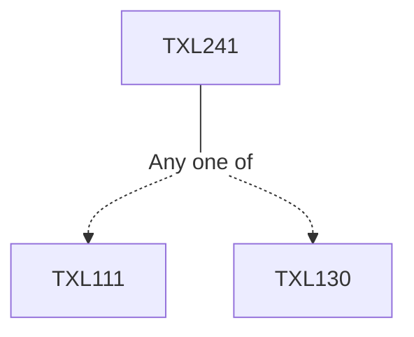

**Credits:** 3 (3-0-0)

**Prerequisites:** [[/Textile and Fibre Engineering/TXL111|TXL111]] or [[/Textile and Fibre Engineering/TXL130|TXL130]]

#### Description
Natural and added impurities in textiles. Singeing, desizing, scouring, bleaching, mercerisation and optical whitening of cotton. Combined preparatory processes Carbonisation, scouring and bleaching of wool, degumming of silk. Preparation of synthetic fibres and blends, heat setting. Machinery for preparation of textiles. Surfactants and their application. Introduction to chemical and mechanical finishes. Chemical finishes for hand modification. Biopolishing, easy care, oil, water and soil repellent finishes. Fire retardancy, antimicrobial finishes. Finishes for wool. Mechanical finishes like shrink proofing and calendering; Raising, sueding and emerising. Low liquor application techniques and machinery; Stenters and dryers.

### Prerequisite Tree

